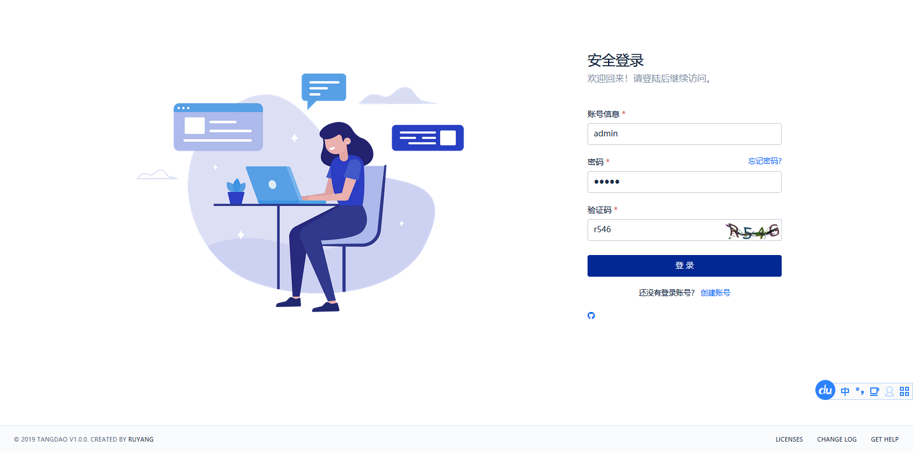

# 权限管理系统 
[](https://www.apache.org/licenses/LICENSE-2.0.html)[](https://gitee.com/ruyangit/tangdao/stargazers)

#### 项目介绍
开源，开源，开源。(github site: [https://tangdao.io](https://github.com/ruyangit/tangdao)) 

#### 技术选型
springboot，spring-security，spring-session，mybatis-plus，redis，fst，beetl...

#### 效果图示



#### 项目进度


#### 安装教程
```
mvn clean install
```

### 运行开发环境
```
mvn springboot:run
```

### 打包压缩后的生产文件
```
mvn package -f pom.xml -Dmaven.test.skip=true
```

#### 使用说明

* 需要数据库MYSQL环境
* 需要缓存REDIS服务

#### 维护计划

* 维护新的项目多模块管理，拆分服务

#### 参与贡献

1. Fork 本项目
2. 新建 Feat_xxx 分支
3. 提交代码
4. 新建 Pull Request
