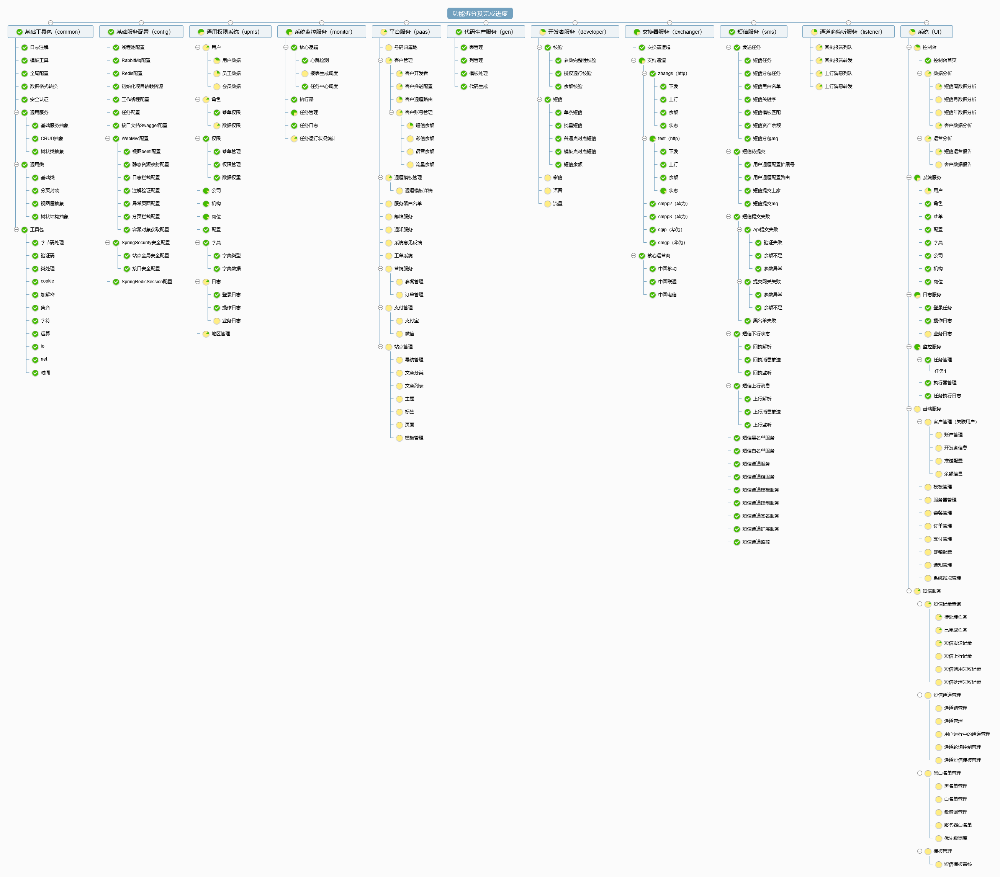

# 综合管理系统 （Tangdao）
[](https://www.apache.org/licenses/LICENSE-2.0.html)       [](https://gitee.com/ruyangit/tangdao/stargazers)

#### 项目介绍
    开源，开源，开源。(github site: [https://tangdao.io](https://github.com/ruyangit/tangdao))  唐刀，唐朝制式军刀，起这个名字主要是偶然间看到这把刀的样子好看、好看、好看。
    该项目原来主要是做一些设计上的演变，后来就直接用作一些小项目的管理系统，目前看到的就是一个基础的权限管理系统，包括用户，角色，菜单，岗位，机构，公司，数据字典，系统配置，日志，缓存（可视化redis），代码生成，组件展示等。

#### 技术选型
springboot，spring-security，spring-session，mybatis-plus，redis，fst，beetl...

#### 效果图示


#### 项目进度


#### 安装教程
```
mvn clean install
```

### 运行开发环境
```
mvn springboot:run
```

### 打包压缩后的生产文件
```
mvn package -f pom.xml -Dmaven.test.skip=true
```

#### 使用说明

* 需要数据库MYSQL环境。
* 需要缓存REDIS服务。

* 注：没有在线预览，请使用本地环境预览。

#### 维护计划

* 本项目仅修复问题，不做新功能的开发。
* 重构项目拆分微服务。

#### 版权说明
本项目遵循 Apache License 2.0 协议。项目借鉴jeesite的设计思路，部分引用作者代码，仅用于学习和内部系统的使用。如有版权问题请联系我。如有需要请支持正版 <a href="https://gitee.com/thinkgem/jeesite4" target="_blank">jeesite</a>。

#### 参与贡献

1. Fork 本项目
2. 新建 Feat_xxx 分支
3. 提交代码
4. 新建 Pull Request
